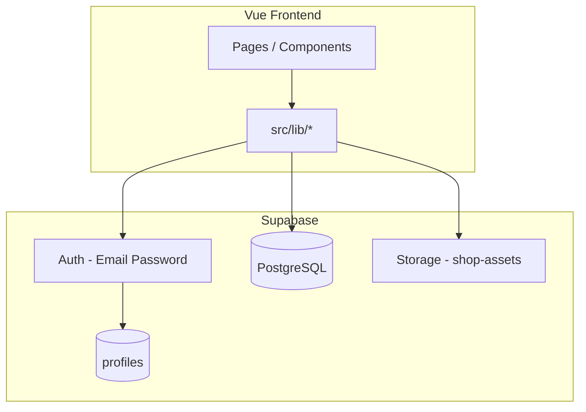
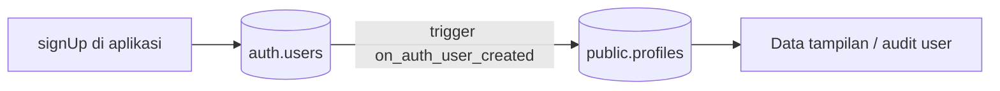
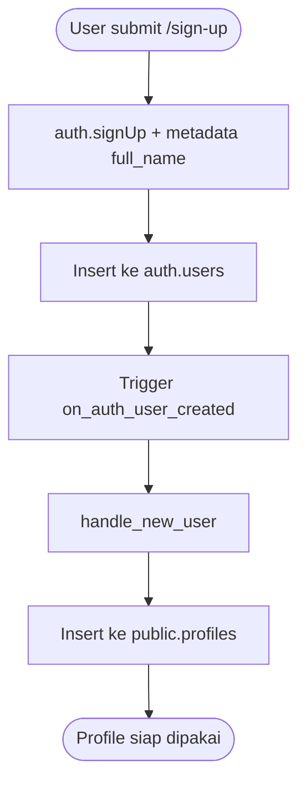
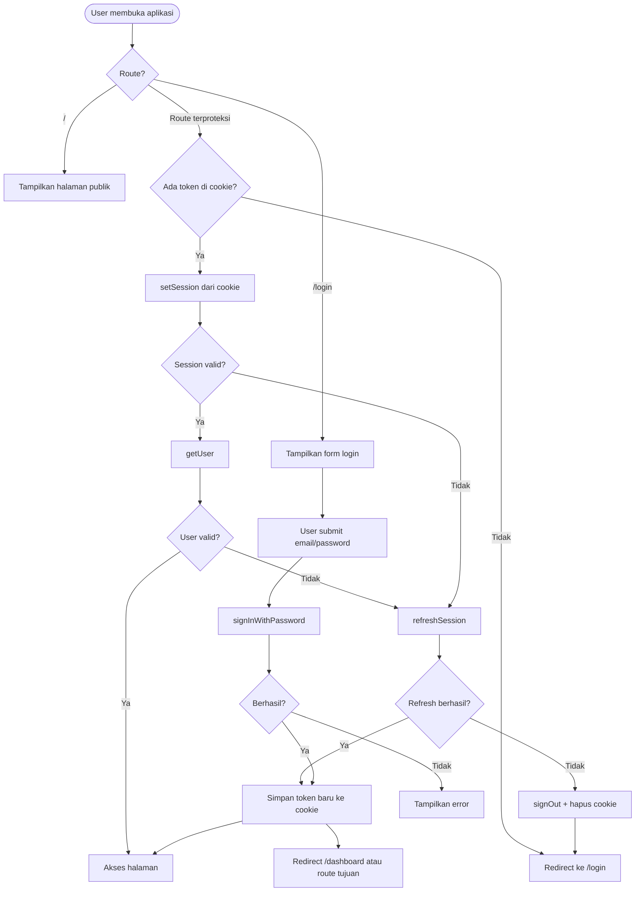
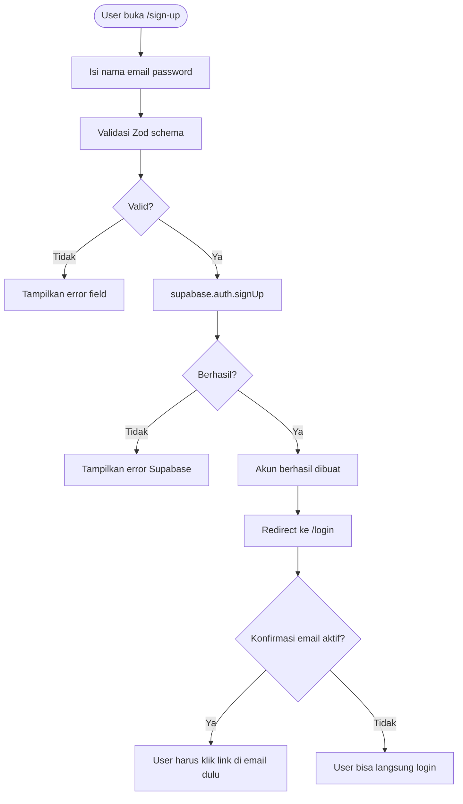
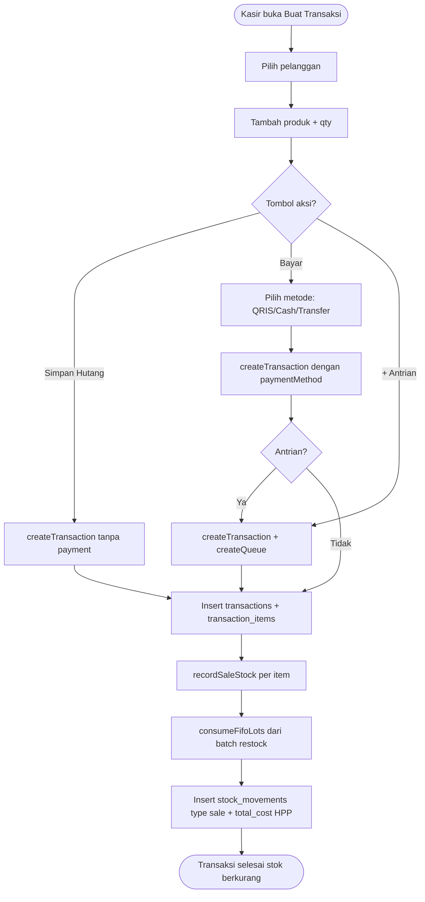
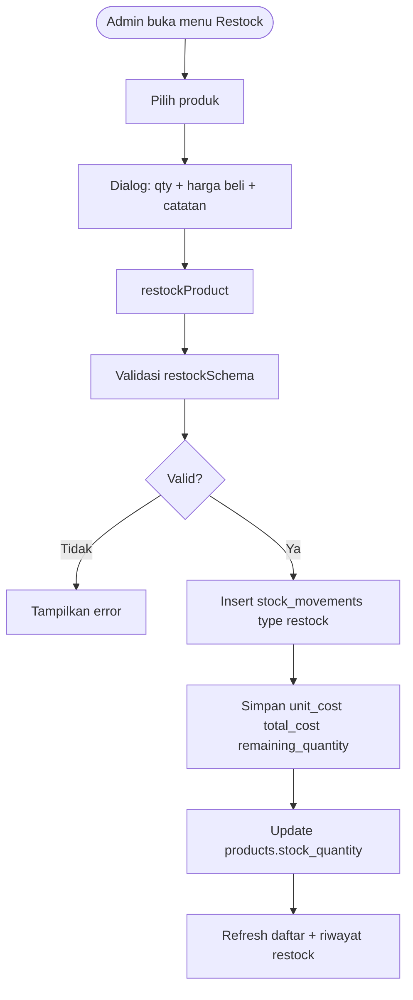
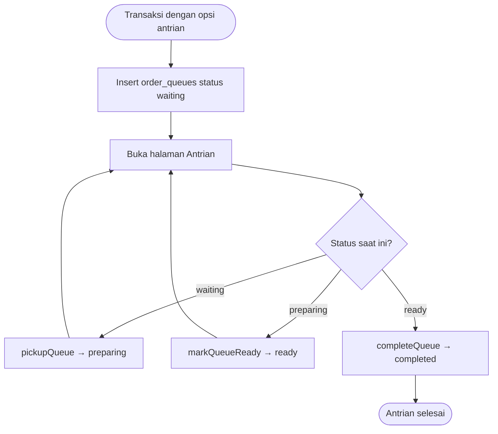
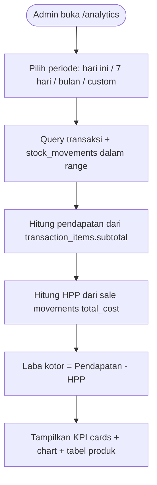

# Vue Supabase Project — Sistem Kasir & Manajemen Warung

Aplikasi web untuk mengelola produk, pelanggan, transaksi penjualan, antrian pesanan, restock stok (dengan HPP FIFO), dan analisis keuntungan. Frontend dibangun dengan **Vue 3 + Vite + TypeScript**, backend/database menggunakan **Supabase** (PostgreSQL + Auth + Storage).

---

## Daftar Isi

1. [Fitur Utama](#fitur-utama)
2. [Arsitektur Singkat](#arsitektur-singkat)
3. [Prasyarat](#prasyarat)
4. [Setup Supabase (Proyek Baru)](#setup-supabase-proyek-baru)
5. [Konfigurasi Autentikasi di Supabase](#konfigurasi-autentikasi-di-supabase)
6. [Setup Profiles untuk Auth](#setup-profiles-untuk-auth)
7. [Menjalankan DDL Database](#menjalankan-ddl-database)
8. [Konfigurasi Aplikasi Lokal](#konfigurasi-aplikasi-lokal)
9. [Menjalankan Aplikasi](#menjalankan-aplikasi)
10. [Struktur Folder Penting](#struktur-folder-penting)
11. [Rute Aplikasi](#rute-aplikasi)
12. [Konsep Bisnis: Stok & HPP](#konsep-bisnis-stok--hpp)
13. [Diagram Aktivitas (Mermaid)](#diagram-aktivitas-mermaid)
14. [Troubleshooting](#troubleshooting)

---

## Fitur Utama

| Modul | Keterangan |
|-------|------------|
| **Halaman publik (`/`)** | Pencarian pelanggan/produk, lihat hutang, instruksi pembayaran QRIS/transfer |
| **Master Produk** | CRUD produk, harga jual, harga beli default, stok awal |
| **Master Pembeli** | CRUD pelanggan |
| **Transaksi** | Buat penjualan, bayar / simpan hutang, antrian opsional |
| **Daftar Transaksi** | Filter lunas/hutang, edit qty item |
| **Antrian** | Status: menunggu → disiapkan → siap → selesai |
| **Restock** | Tambah stok per batch dengan harga beli & riwayat |
| **Analisis** | Pendapatan, HPP FIFO, laba kotor, chart, ranking produk |
| **Konfigurasi** | Upload QRIS, data rekening transfer |

---

## Arsitektur Singkat



- **Autentikasi**: Supabase Auth (email + password). Token disimpan di cookie browser, divalidasi di `router.beforeEach`.
- **Data**: Semua operasi CRUD via Supabase JS client dengan Row Level Security (RLS).
- **Stok**: Perubahan stok **hanya** lewat `src/lib/stock.ts` → mencatat `stock_movements` + update `products.stock_quantity`.

---

## Prasyarat

- [Node.js](https://nodejs.org/) `^20.19` atau `>=22.12`
- [pnpm](https://pnpm.io/) (disarankan) atau npm
- Akun [Supabase](https://supabase.com/) (gratis cukup untuk development)
- Git (opsional)

---

## Setup Supabase (Proyek Baru)

### 1. Buat proyek

1. Login ke [Supabase Dashboard](https://supabase.com/dashboard).
2. Klik **New project**.
3. Isi nama proyek, password database, dan region (pilih yang terdekat, mis. Singapore).
4. Tunggu hingga proyek selesai diprovisioning.

### 2. Ambil kredensial API

1. Buka proyek → **Project Settings** (ikon gear) → **API**.
2. Catat:
   - **Project URL** → dipakai sebagai `VITE_SUPERBASE_URL`
   - **anon public** key → dipakai sebagai `VITE_SUPERBASE_PUBLISH_KEY`

> **Penting:** Jangan pernah commit file `.env` ke Git. Gunakan `.env.example` sebagai template.

### 3. Aktifkan Email Auth

1. Buka **Authentication** → **Providers**.
2. Pastikan **Email** dalam keadaan **Enabled**.
3. Untuk development, disarankan menonaktifkan konfirmasi email agar bisa langsung login setelah sign-up:
   - **Authentication** → **Providers** → **Email** → matikan **Confirm email**
   - Atau: **Authentication** → **Settings** → **Enable email confirmations** → OFF

---

## Konfigurasi Autentikasi di Supabase

Aplikasi memakai alur berikut:

1. User **Sign Up** (`/sign-up`) → `supabase.auth.signUp()`
2. User **Login** (`/login`) → `supabase.auth.signInWithPassword()`
3. Session disimpan ke cookie: `_access_token`, `_refresh_token`, `_user_email`, dll. (`src/lib/cookies.ts`)
4. Setiap navigasi ke route terproteksi → `validateOrRefreshSession()` di `src/lib/auth.ts`:
   - Coba `setSession` dari cookie
   - Jika gagal → `refreshSession`
   - Jika refresh gagal → logout & redirect ke `/login`
5. Route publik: `/` (halaman pelanggan), `/login`
6. Route terproteksi: semua path lain (dashboard, transaksi, master data, dll.)

### Buat user admin pertama

**Opsi A — lewat aplikasi**

1. Jalankan `pnpm dev`
2. Buka `http://localhost:5173/sign-up`
3. Daftar akun
4. Login di `/login`

**Opsi B — lewat Supabase Dashboard**

1. **Authentication** → **Users** → **Add user**
2. Isi email & password → centang **Auto Confirm User**
3. Login lewat aplikasi dengan kredensial tersebut

### Redirect URL (opsional, untuk production)

Di **Authentication** → **URL Configuration**:

- **Site URL**: URL production Anda (mis. `https://warung-anda.com`)
- **Redirect URLs**: tambahkan `http://localhost:5173/**` untuk development

---

## Setup Profiles untuk Auth

Supabase Auth menyimpan akun login di schema `auth.users`. Tabel **`public.profiles`** melengkapi data yang bisa ditampilkan di aplikasi (nama, email) dan terhubung 1:1 dengan user auth.



### Mengapa perlu profiles?

| Tanpa `profiles` | Dengan `profiles` |
|------------------|-------------------|
| Nama hanya di cookie `_user_email` | Nama lengkap tersimpan di database |
| Data user tersebar di metadata auth | Satu tabel mudah di-query dari aplikasi |
| User lama tidak punya record terstruktur | Backfill otomatis untuk user yang sudah ada |

### Langkah 1 — Jalankan DDL profiles

File [`DDL/profiles.ddl`](DDL/profiles.ddl) sudah menyertakan fungsi `handle_updated_at()` sendiri, jadi **tidak wajib** menjalankan `customers.ddl` terlebih dahulu (meskipun tetap disarankan mengikuti urutan DDL lengkap di bawah).

1. Buka [`DDL/profiles.ddl`](DDL/profiles.ddl).
2. Salin seluruh isi → Supabase **SQL Editor** → **Run**.

Jika sebelumnya gagal di tengah jalan, aman untuk **jalankan ulang** file yang sama (script sudah idempotent).

Yang dibuat:

- Tabel `profiles` (`id`, `full_name`, `email`, `created_at`, `updated_at`)
- RLS: baca publik; insert/update hanya user sendiri (`auth.uid() = id`)
- Fungsi `handle_new_user()` + trigger `on_auth_user_created` di `auth.users`
- Backfill baris `profiles` untuk user yang sudah terdaftar sebelumnya

### Langkah 2 — Metadata nama saat sign-up

Aplikasi mengirim nama ke Supabase Auth lewat `user_metadata`:

```ts
// src/lib/auth.ts
supabase.auth.signUp({
  email,
  password,
  options: { data: { full_name: name } },
})
```

Trigger `handle_new_user` membaca `raw_user_meta_data->>'full_name'` dan menyimpannya ke `profiles.full_name`.

### Langkah 3 — Verifikasi profiles

Setelah sign-up atau backfill, jalankan di SQL Editor:

```sql
select
  u.id,
  u.email as auth_email,
  p.full_name,
  p.email as profile_email,
  p.created_at
from auth.users u
left join public.profiles p on p.id = u.id
order by p.created_at desc nulls last;
```

Setiap baris di `auth.users` seharusnya punya pasangan di `profiles` (`full_name` bisa kosong untuk user lama tanpa metadata).

### Langkah 4 — (Opsional) User admin via Dashboard

Jika membuat user lewat **Authentication → Users → Add user**:

1. Centang **Auto Confirm User**
2. Di **User Metadata**, tambahkan JSON:

```json
{
  "full_name": "Admin Warung"
}
```

3. Jika user dibuat **sebelum** `profiles.ddl` dijalankan, jalankan ulang bagian backfill di akhir file DDL, atau:

```sql
insert into public.profiles (id, full_name, email)
select id, coalesce(raw_user_meta_data->>'full_name', 'Admin'), email
from auth.users
where id not in (select id from public.profiles);
```

### Diagram: pembuatan profile otomatis



---

## Menjalankan DDL Database

Semua skema SQL ada di folder [`DDL/`](DDL/). Jalankan di **Supabase SQL Editor** (**SQL** → **New query**) **berurutan** seperti di bawah.

> Untuk instalasi **baru**, ikuti urutan 1–9. File migrasi (alter) boleh dilewati jika tabel sudah dibuat dengan versi terbaru dari file dasar.

| No | File | Keterangan |
|----|------|------------|
| 1 | [`DDL/customers.ddl`](DDL/customers.ddl) | Tabel `customers` + RLS + fungsi `handle_updated_at()` |
| 2 | [`DDL/profiles.ddl`](DDL/profiles.ddl) | Tabel `profiles` + `handle_updated_at()` + trigger auto-create dari `auth.users` |
| 3 | [`DDL/product.ddl`](DDL/product.ddl) | Tabel `products` (termasuk `purchase_price`) + RLS |
| 4 | [`DDL/transactions.ddl`](DDL/transactions.ddl) | Tabel `transactions`, `transaction_items` + walk-in customer |
| 5 | [`DDL/transaction_payment_method.ddl`](DDL/transaction_payment_method.ddl) | Kolom `payment_method`, `paid_at` *(lewati jika sudah ada di langkah 4)* |
| 6 | [`DDL/shop_config.ddl`](DDL/shop_config.ddl) | Tabel `shop_config`, bucket storage `shop-assets` |
| 7 | [`DDL/order_queues.ddl`](DDL/order_queues.ddl) | Tabel `order_queues` (antrian dapur) |
| 8 | [`DDL/stock_movements.ddl`](DDL/stock_movements.ddl) | Tabel audit stok `stock_movements` |
| 9 | [`DDL/stock_lot_allocations.ddl`](DDL/stock_lot_allocations.ddl) | Alokasi FIFO penjualan ke batch restock |

**Migrasi — hanya jika database sudah ada sebelum fitur tersebut:**

| File | Kapan dijalankan |
|------|------------------|
| [`DDL/product_purchase_price.ddl`](DDL/product_purchase_price.ddl) | Jika `products` dibuat **tanpa** kolom `purchase_price` |
| [`DDL/stock_movements_costing.ddl`](DDL/stock_movements_costing.ddl) | Jika `stock_movements` dibuat **tanpa** kolom costing |
| [`DDL/order_queues_table_number.ddl`](DDL/order_queues_table_number.ddl) | Jika `order_queues` dibuat **tanpa** `table_number` |
| [`DDL/order_queues_realtime.ddl`](DDL/order_queues_realtime.ddl) | **Wajib** untuk antrian realtime di halaman `/queue` |
| [`DDL/product_addons.ddl`](DDL/product_addons.ddl) | Tipe produk menu/addon, mapping addon, addon per transaksi |
| [`DDL/masterdata_policies.ddl`](DDL/masterdata_policies.ddl) | Jika insert/update produk/pelanggan mengembalikan **403** |

### Cara menjalankan di SQL Editor

1. Buka file `.ddl` di editor teks.
2. Salin seluruh isinya.
3. Di Supabase → **SQL** → **New query** → paste → **Run**.
4. Pastikan muncul pesan sukses sebelum lanjut ke file berikutnya.

### Verifikasi cepat

Jalankan query ini setelah semua DDL:

```sql
select table_name
from information_schema.tables
where table_schema = 'public'
  and table_name in (
    'customers', 'profiles', 'products', 'transactions', 'transaction_items',
    'shop_config', 'order_queues', 'stock_movements', 'stock_lot_allocations'
  )
order by table_name;
```

Harus mengembalikan **9** baris.

---

## Konfigurasi Aplikasi Lokal

### 1. Clone & install dependency

```sh
cd vue-superbase-project
pnpm install
```

### 2. Buat file `.env`

Salin dari `.env.example`:

```sh
cp .env.example .env
```

Isi nilai:

```env
VITE_SUPERBASE_URL=https://xxxxxxxx.supabase.co
VITE_SUPERBASE_PUBLISH_KEY=eyJhbGciOiJIUzI1NiIsInR5cCI6IkpXVCJ9...

# Opsional: nomor WA untuk kirim bukti bayar dari halaman publik (format: 6281234567890)
VITE_PAYMENT_PROOF_WHATSAPP=6281234567890
```

---

## Menjalankan Aplikasi

```sh
# Development (hot reload)
pnpm dev

# Build production
pnpm build

# Preview build
pnpm preview

# Lint
pnpm lint
```

Buka browser: `http://localhost:5173`

| URL | Akses |
|-----|-------|
| `/` | Publik — pencarian pelanggan |
| `/login` | Guest |
| `/sign-up` | Guest |
| `/transactions`, `/master/products`, dll. | Harus login |

---

## Struktur Folder Penting

```
vue-superbase-project/
├── DDL/                    # Skrip SQL Supabase (jalankan manual)
├── src/
│   ├── pages/              # Halaman per route
│   ├── components/         # UI & form
│   ├── lib/
│   │   ├── supabase.ts     # Klien Supabase
│   │   ├── auth.ts         # Login, session, refresh
│   │   ├── product.ts      # Master produk
│   │   ├── transaction.ts  # Penjualan & hutang
│   │   ├── stock.ts        # Restock, FIFO, pergerakan stok
│   │   ├── queue.ts        # Antrian
│   │   ├── analytics.ts    # Laporan laba
│   │   └── config.ts       # QRIS & rekening
│   ├── types/database.ts   # TypeScript types
│   └── router/index.ts     # Route guard auth
├── .env.example
└── package.json
```

---

## Rute Aplikasi

| Path | Halaman | Grup sidebar |
|------|---------|--------------|
| `/` | Pencarian publik | — |
| `/login` | Login | — |
| `/sign-up` | Daftar akun | — |
| `/transactions` | Buat transaksi | Operasional |
| `/transactions/list` | Daftar transaksi | Operasional |
| `/queue` | Antrian | Operasional |
| `/stock/restock` | Restock | Operasional |
| `/analytics` | Analisis keuntungan | Laporan |
| `/master/products` | Master produk | Master Data |
| `/master/customers` | Master pembeli | Master Data |
| `/config` | Konfigurasi toko | Pengaturan |

---

## Konsep Bisnis: Stok & HPP

| Istilah | Arti di aplikasi ini |
|---------|----------------------|
| **Harga jual** | `products.price` — harga ke pelanggan |
| **Harga beli (default)** | `products.purchase_price` — pre-fill saat restock |
| **Harga beli per batch** | `stock_movements.unit_cost` — terkunci saat restock |
| **HPP** | Harga Pokok Penjualan = biaya stok yang terpakai saat dijual (FIFO) |
| **Laba kotor** | Pendapatan − HPP |

Alur stok:

- **Restock** → tambah stok + catat batch dengan `unit_cost`
- **Penjualan** → kurangi stok FIFO + catat `sale` movement dengan `total_cost` (HPP)
- **Edit transaksi** → penyesuaian stok via `adjustment` / `sale` delta

---

## Diagram Aktivitas (Mermaid)

### 1. Autentikasi (Login & Session Guard)



### 2. Registrasi Akun Baru



### 3. Buat Transaksi & Pengaruh Stok



### 4. Restock Produk



### 5. Antrian Pesanan (Dapur)



### 6. Halaman Publik — Cek Hutang Pelanggan

```mermaid
flowchart TD
  start([Pelanggan buka "/"]) --> search[Ketik nama pelanggan]
  search --> query[getCustomers + getCustomersWithDebt]
  query --> showList[Tampilkan kartu pelanggan + nominal hutang]
  showList --> clickCard{Klik pelanggan?}
  clickCard -->|Ya| unpaidDialog[Dialog item belum lunas]
  unpaidDialog --> payCTA{Mau bayar?}
  payCTA -->|Ya| paymentDialog[Instruksi QRIS / Transfer dari shop_config]
  paymentDialog --> waOpsional[Kirim bukti via WhatsApp jika dikonfigurasi]
  clickCard -->|Tidak| search
```

### 7. Analisis Keuntungan



---

## Troubleshooting

| Masalah | Solusi |
|---------|--------|
| Login gagal "Invalid login credentials" | Cek email/password; pastikan user sudah confirmed di Supabase |
| Sign up tidak bisa login | Matikan **Confirm email** di Supabase Auth, atau konfirmasi lewat email |
| Setelah sign-up, `profiles` kosong | Pastikan [`DDL/profiles.ddl`](DDL/profiles.ddl) sudah dijalankan **setelah** `customers.ddl`; cek trigger `on_auth_user_created` |
| User Dashboard tanpa baris `profiles` | Jalankan query backfill di bagian [Setup Profiles](#langkah-5--opsional-user-admin-via-dashboard) |
| Insert produk/pelanggan **403** | Jalankan [`DDL/masterdata_policies.ddl`](DDL/masterdata_policies.ddl); pastikan sudah login |
| Upload QRIS gagal | Pastikan [`DDL/shop_config.ddl`](DDL/shop_config.ddl) sudah dijalankan (bucket `shop-assets`) |
| HPP selalu 0 | Isi **harga beli** saat tambah produk atau restock; data lama mungkin belum punya costing |
| Penjualan gagal "stok batch tidak mencukupi" | Restock dulu atau jalankan migrasi `stock_movements_costing.ddl` untuk backfill batch |
| Variable env tidak terbaca | Nama harus `VITE_SUPERBASE_URL` dan `VITE_SUPERBASE_PUBLISH_KEY`; restart `pnpm dev` setelah ubah `.env` |
| Antrian tidak update otomatis | Jalankan [`DDL/order_queues_realtime.ddl`](DDL/order_queues_realtime.ddl), atau Database → Publications → `supabase_realtime` → tambah `order_queues` |
| Badge Live tidak muncul di Antrian | Pastikan sudah login; cek koneksi WebSocket ke Supabase tidak diblokir firewall |

---

## Lisensi

Proyek private — sesuaikan lisensi sesuai kebutuhan tim Anda.
